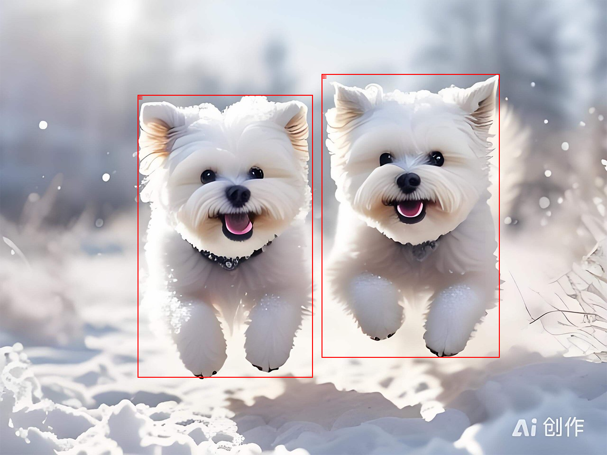

## Object Detection with VLM

**Effect display**




### Build
```bash

sudo docker build -t binarii/vl-object-detect .

# or through proxy, replace with your own proxy server
sudo docker build \
     --build-arg https_proxy=http://10.252.25.251:1085 \
     --build-arg http_proxy=http://10.252.25.251:1085 \
     --build-arg all_proxy=socks5://10.252.25.251:1085 \
     -t binarii/vl-object-detect .

```

### Run

Modify the `compose.yml` according to the actual situation before running

- Pay attention to the `OUTPUT_HTTP_PREFIX` environment variable

```bash

sudo docker compose up -d

# Modify the URL according to the actual situation.
curl -s http://10.252.25.251:8186/detect \
     -F image="https://gips2.baidu.com/it/u=1192674964,3939660937&fm=3028&app=3028&f=JPEG&fmt=auto?w=1280&h=960" \
     -F prompt="puppy" | jq

```

Api output

```json

{
  "json_output": [
    {
      "bbox_2d": [
        290,
        200,
        659,
        796
      ],
      "label": "小狗"
    },
    {
      "bbox_2d": [
        678,
        156,
        1053,
        754
      ],
      "label": "小狗"
    }
  ],
  "bboxes_only": [
    [
      290,
      200,
      659,
      796
    ],
    [
      678,
      156,
      1053,
      754
    ]
  ],
  "image": "http://10.252.25.251:8186/images/a120b674aa8f469b92aa6bb13bf9f029.png"
}

```
